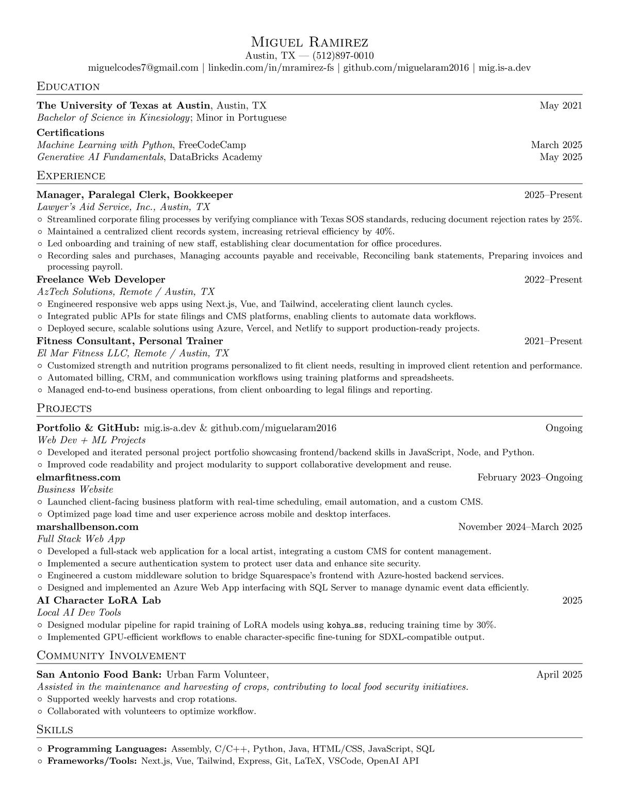

# Miguel Ramirez - Resume

[](LICENSE)

This repository contains the LaTeX source code for my professional resume.
It’s designed to be easy to edit, compile, and preview directly in VSCode using LaTeX Workshop, with automated PDF → PNG conversion for embedding previews in GitHub.

---

## 📄 Preview
> The PDF in this repository is for preview purposes only.  
> If you want the most up-to-date version, please contact me directly.

👉 [Click here to view the PDF](https://github.com/miguelaram2016/mr-resume/blob/master/mr_resume.pdf)

[](https://github.com/miguelaram2016/mr-resume/blob/master/mr_resume.pdf)

---

## 🛠️ Tools & Technologies Used

### Core Resume Tech
- **LaTeX** – for professional document formatting
- **MiKTeX** – TeX distribution for Windows *(includes TeX Live–compatible packages)*
- **Strawberry Perl** – required by MiKTeX for certain workflows

### Editor & Extensions
- **Visual Studio Code (VSCode)** – development environment
- **LaTeX Workshop** – VSCode extension for compiling and managing LaTeX
- **Git + GitHub** – version control and collaboration

### PDF → PNG Conversion
- **ImageMagick** – high-quality PDF rendering to PNG
- **Ghostscript** – backend for PDF rasterization

---

## 🚀 How to Build
1. **Clone the repo**
   ```bash
   git clone https://github.com/miguelaram2016/mr-resume.git
   cd mr-resume
2. Open in VSCode
   Install the LaTeX Workshop extension.
3. Compile the resume
- Open mr_resume.tex
- Run the LaTeX Workshop build recipe (Ctrl + Alt + B by default)
- This will generate both:
    - mr_resume.pdf
    - mr_resume_preview.png (for README display)
   
---

## 🪪 License
Formatting & template: Licensed under the MIT License

Content & data: © Miguel Ramirez – All rights reserved